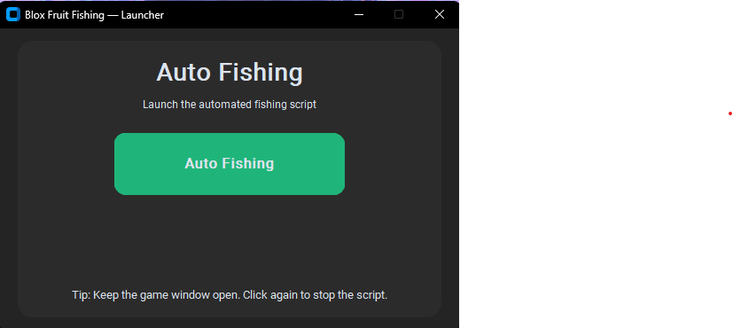
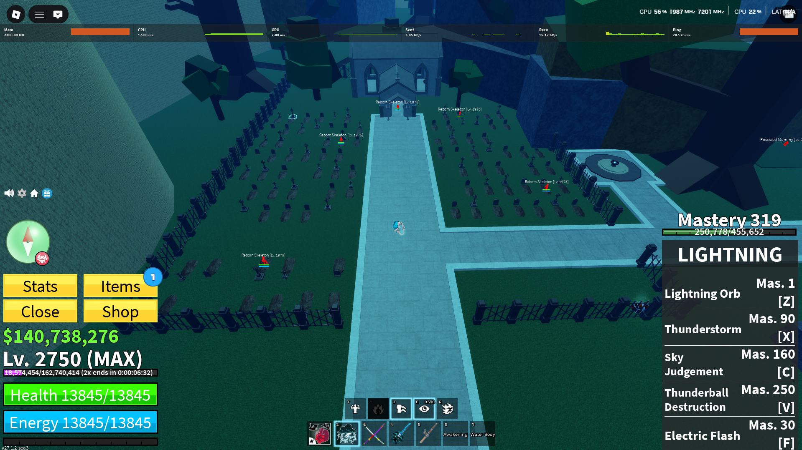

# Blox Fruit Fishing Macro

Welcome to my macro! We call it a fishing macro, but it can be used for way more than just fishing. I'm working on making this a macro loader, meaning you can create combos and more using this tool.

## Features

Note out yet still working on the project

## Upcoming Features

- **Auto Fishing**: Working on a nice GUI and additional features.

- **Auto Bone Grinding**: Currently works with Elemental fruits. Make sure you stand at the position shown below — click the image to view full size.

- **Auto Webhook**: This will be useful for notifications and updates.
- **PvP Aim Assist**: Please note that the aim assist will provide subtle assistance and will be barely noticeable. It only works when using Ken; otherwise, it does nothing.
- **Combo Loader**: Create your own combos. If you share them with me, I'll add them to the main script.
- **Up Trader**: This will check trade values on the <https://bloxfruitsvalues.com/values> and check what they put in baced on that it will and for fair trades It is a computer so it will do the math better than you and it wont trade for unfair and the uptrade will be atleast 5% min you can change this

## How to run the Launcher

1. Open the Runme.bat
2. Run Main.py
3. Select what you would loke it to do
4. Have fun.

If you have any ideas, feel free to drop them to me on Discord: [https://discord.gg/dHUM2ejQGY](https://discord.gg/dHUM2ejQGY)
